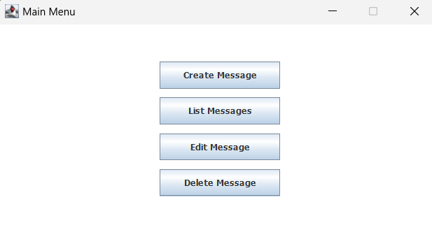
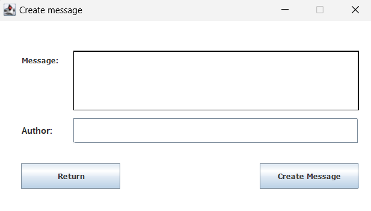
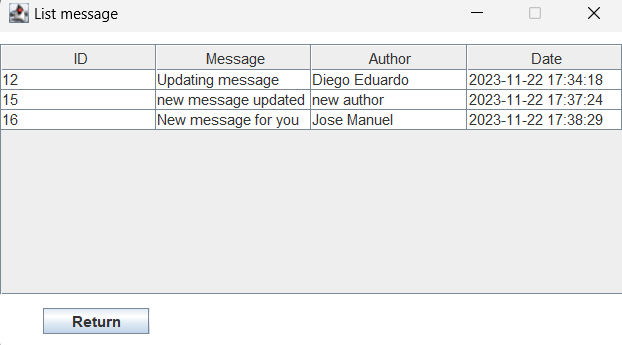

##Java Backend | appmessage 

### Used technology:
  - [Eclipse](https://www.eclipse.org/)
  - [MySql](https://www.mysql.com/)
  - [Java Swing](https://docs.oracle.com/javase/tutorial/uiswing/)
  - [Maven](https://maven.apache.org/)
  
### Project description

This project is part of the platzi course JavaSE Data Persistence Course, practicing the knowledge acquired during the course.

     

     

     

## Contact

